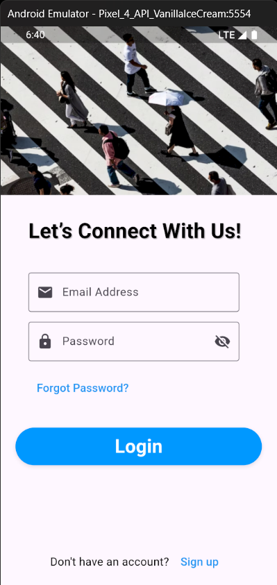
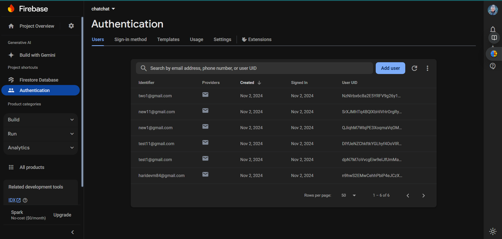

# SHA Chatbot

SHA Chatbot is a Flutter-based chatbot application that allows users to communicate seamlessly. It features a user-friendly interface with a Splash Screen, Login Page, Signup Page, and Password Recovery functionality. All messages are stored in Firebase, providing a robust backend for user interactions.

## Features

- **Splash Screen**: A welcoming screen that loads when the application starts.
- **User Authentication**:
    - **Login Page**: Allows users to log in with their credentials.
    - **Signup Page**: Enables new users to create an account.
    - **Forgot Password**: Provides a way for users to reset their password.
- **Chat Functionality**: Users can send and receive messages through a dedicated chat interface, managed by `message.dart`.
- **Firebase Integration**: All messages are stored in Firebase, ensuring secure and reliable data management for each user.

## Getting Started

This project is a starting point for a Flutter application. To set it up locally, follow the steps below:

### Prerequisites

- Flutter SDK
- Dart SDK
- Firebase account and a project set up in Firebase Console

### Installation

1. **Clone the repository**:

   ```bash
   git clone https://github.com/yourusername/SHA-chatbot.git
   ```

2. **Navigate to the project directory**:

   ```bash
   cd SHA-chatbot
   ```

3. **Install dependencies**:

   ```bash
   flutter pub get
   ```

4. **Set up Firebase**:
    - Follow the Firebase documentation to add your Flutter app to Firebase.
    - Configure the `google-services.json` or `GoogleService-Info.plist` in your project as per the instructions.

5. **Run the application**:

   ```bash
   flutter run
   ```

### Resources

- [Lab: Write your first Flutter app](https://docs.flutter.dev/get-started/codelab)
- [Cookbook: Useful Flutter samples](https://docs.flutter.dev/cookbook)

For additional help getting started with Flutter development, view the [online documentation](https://docs.flutter.dev/), which offers tutorials, samples, guidance on mobile development, and a full API reference.

## Screenshots

Add your project images here to showcase the features of your application.







## License

This project is licensed under the MIT License. See the LICENSE file for details.
