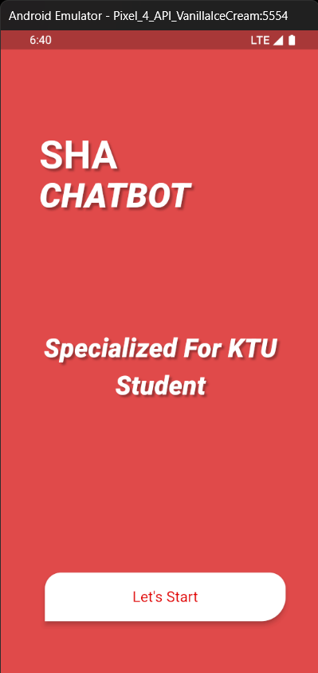
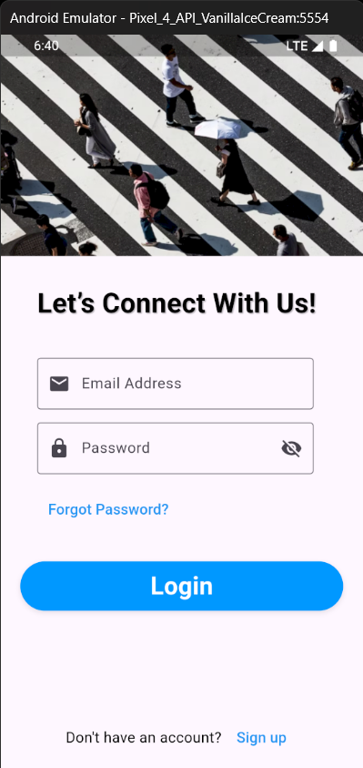
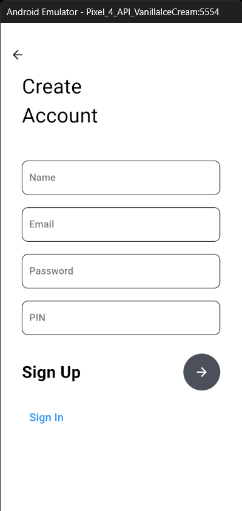
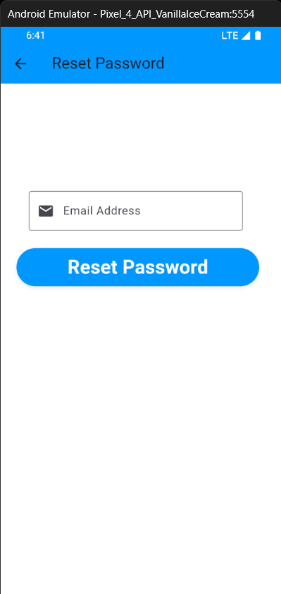
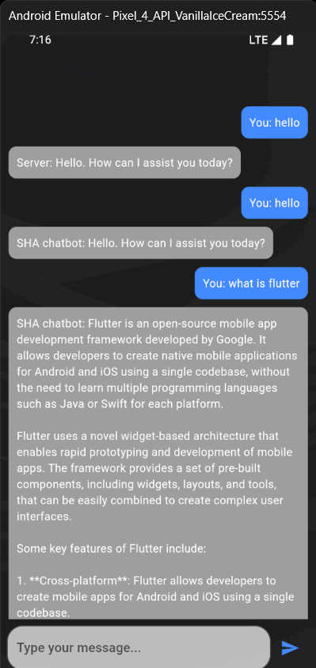
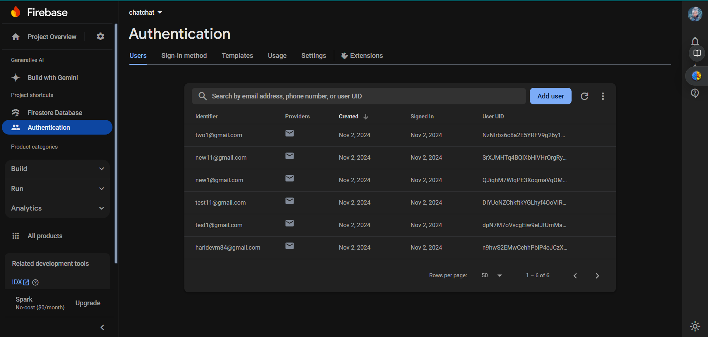

# USELESS_PROJECT_KTULLM

<!-- # [KTU LLM]

# IMPORTANT : Trying to execute this as whole code might be very confusing so please feel fee to contact us for support

Haridev M :
email: haridevm84@gmail.com
Sabari Vijayan:
-->

#Updated link to video proof
 https://drive.google.com/drive/folders/10iJcUqTLD9Orh22DwsqN-QXHk6Pq3SvX?usp=drive_link

## BASIC DETAILS
### TEAM NAME: Greyscale

### Team Members:
- Team Lead: [Sabari Vijayan]     - Rajiv Gandhi Institute of Technology, Kottayam
- Member 2: [Haridev M]           - Rajiv Gandhi Institute of Technology, Kottayam
- Member 3: [Anna Grace Abraham]  - Rajiv Gandhi Institute of Technology, Kottayam

 
 ### Project Description
- This project aims to create a fine-tuned language model specialized in the KTU (Kerala Technological University) syllabus. The goal is to develop a resource that can answer questions, summarize content, and provide insights based on the KTU curriculum, making study and revision easier for students. By fine-tuning a language model on KTU-specific content such as textbooks, syllabus documents, and past question papers, we can create a powerful tool for academic assistance.

## Academic Resource Collection

This project collects and structures academic resources such as KTU textbooks, syllabus documentation, and past question papers.

## The Solution

Using a specialized language model, this tool enables easy study and revision of KTU topics, offering summaries, explanations, and question-answering functionalities tailored to the KTU curriculum.

## Technical Details

### Software

#### Languages
- 
- 

#### Frameworks
- 

#### Libraries
- 
- 

#### Tools
- 

### Interface
- The project includes a mobile app built with  to provide an accessible interface for interacting with the KTU-specific language model. The app allows users to query, receive answers, and get summaries tailored to the KTU syllabus.


### Hardware

- **Requirements:** Standard PC (adjust specifications based on data and model size requirements)

## Getting Started

1. Install the required libraries:
   ```bash
   pip install pandas transformers

  ### Implementation
  For Software:

  # Installation


  #Run


  ### Project Documentation
  For Software

  ## Screenshots
 






  # Diagrams

  # Schematic & Circuit

  # Build Photos

  ### Project Demo


  # Additional Demos
  


For additional demos please refer to these resources

Reddit : https://www.reddit.com/r/LocalLLaMA/comments/1e416fo/stepbystep_tutorial_how_to_finetune_llama_3_8b/

Unsloth Demo : https://docs.unsloth.ai/tutorials/how-to-finetune-llama-3-and-export-to-ollama

 ## Team Contributions

Our project was brought to life through the dedicated efforts and expertise of each team member, contributing uniquely to the creation of a robust and effective academic tool.

- **[Sabari]**: Fine-tuned the large language model (LLM), optimizing it for accuracy and relevance to the KTU syllabus, ensuring that the model is both responsive and informative for students.

- **[Haridev]**: Developed the server and application infrastructure, seamlessly integrating it with the LLM model to provide an efficient and user-friendly interface for interaction.

- **[Anna]**: Curated and prepared the dataset for training, also contributing to the fine-tuning process of the LLM, which was critical to the model's ability to offer tailored responses aligned with the KTU curriculum.

 
    ---
